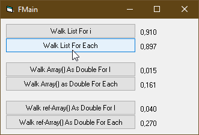

# XL_MacroTools  
## Some very useful excel macros for engineers  

[](https://github.com/OlimilO1402/XL_MakroTools/blob/master/LICENSE) 
[](https://github.com/OlimilO1402/XL_MakroTools/releases/latest)
[](https://github.com/OlimilO1402/XL_MakroTools/releases/download/v2026.03.30/XLMakroTools_v2026.03.30.zip)


Project started around 2005.  
In this repo you can find some excel macros, I collected over the past 25 years, and I use every day in my life as an engineer.  
In no particular order.  
  
Linear interpolation  
--------------------  

of a value based on surrounding values, either horizontally or vertically:

  - horizontally
```vba
Sub LinIPol_H()
'
' LinIPol_H Makro
' Lineare Interpolation Horizontal
'
' Tastenkombination: Strg+Umschalt+I
'

'LinIPol_H
'Formel in C4
'=WENN(B3 = D3; B4; B4 + (D4 - B4) / (D3 - B3) * (C3 - B3))

    Dim C As Range: Set C = Excel.Selection
    
    C.FormulaR1C1 = "=IF(R[-1]C[-1] = R[-1]C[+1], RC[-1], RC[-1] + (RC[+1] - RC[-1]) / (R[-1]C[+1] - R[-1]C[-1]) * (R[-1]C - R[-1]C[-1]))"
    
End Sub
```

  - vertically
```vba
Sub LinIPol_V()
'
' LinIPol_V Makro
' Lineare Interpolation Vertikal
'
' Tastenkombination: Strg+Umschalt+V
'

'LinIPol_V
'Formel in I3
'=WENN(H2 = H4; I2; I2 + (I4 - I2) / (H4 - H2) * (H3 - H2))
    
    Dim C As Range: Set C = Excel.Selection
    
    C.FormulaR1C1 = "=IF(R[-1]C[-1] = R[+1]C[-1], R[-1]C, R[-1]C + (R[+1]C - R[-1]C) / (R[+1]C[-1] - R[-1]C[-1]) * (RC[-1] - R[-1]C[-1]))"
    
End Sub
```

Swap Cells
----------

swaps the value and the formula of two adjacent selected cells. 

```vba
Sub SwapAdjacentCells()
    
    Dim r As Range:         Set r = Excel.Selection
    Dim i As Long, ui As Long: ui = r.Rows.Count
    Dim j As Long, uj As Long: uj = r.Columns.Count
    
    If uj < 2 Then
        MsgBox "Select 2 columns"
        Exit Sub
    End If
    If uj > 2 Then
        MsgBox "Select maximum 2 columns"
        Exit Sub
    End If
    
    Dim c1 As Range, c2 As Range
    For i = 1 To ui
        Set c1 = r.Cells(i, 1)
        Set c2 = r.Cells(i, 2)
        SwapCells c1, c2
    Next
End Sub

Sub SwapCells(c1 As Range, c2 As Range)
    
    Dim v: v = c1.Value
    Dim F: F = c1.Formula
    
    c1.Value = c2.Value
    c1.Formula = c2.Formula
    
    c2.Value = v
    c2.Formula = F
    
End Sub
```

Left Append
-----------

Appends the values of the selected cells as strings to the cell on the far left, inserting a space between each value.  
This is done for each row of all selected cells.  

```vba
Sub LeftAppend()
    'Dim wks As Worksheet: Set wks = ActiveWorkbook.ActiveSheet
    Dim r As Range: Set r = Excel.Selection
    Dim C As Range, s As String
    Dim Row As Long, Col As Long
    For Row = 1 To r.Rows.Count
        'von rechts
        For Col = r.Columns.Count To 1 Step -1
            Set C = r.Cells(Row, Col)
            s = C.Value & " " & s
            C.Value = ""
        Next
        If Left(s, 1) = "=" Then s = "'" & s
        C.Value = s
        s = ""
    Next
End Sub
```

Verification Red/Green  
----------------------  

Compares the value in the cell to the left with 1 (or 1.03) and inserts "OK" or "Warning.".
Applies two conditional formatting rules:  
if the cell contains "OK," it turns green;  
if it contains "Warning," it turns red.  
  
```vba
Sub VerificationRedGreen()
'
' FormatNachweisRotGrün Makro
' Vergleicht den Wert in der links danebenliegenden Zelle mit 1 (bzw. 1.03) und fügt "OK" oder "Achtung" ein
' Macht 2*bedingte Formatierung wenn Zelle "OK" enthält dann Grün, wenn Zelle "Achtung" enthält dann Rot.
'
    Dim C As Range: Set C = Selection
    
    C.FormulaR1C1 = "=IF(RC[-1]<=1.03, ""OK"", ""Achtung!"")"
    'Range("G43").Select

    C.FormatConditions.Add Type:=xlTextString, String:="OK", TextOperator:=xlContains
    C.FormatConditions(Selection.FormatConditions.Count).SetFirstPriority
    With C.FormatConditions(1).Font
        .color = -16752384
        .TintAndShade = 0
    End With
    With C.FormatConditions(1).Interior
        .PatternColorIndex = xlAutomatic
        .color = 13561798
        .TintAndShade = 0
    End With
    C.FormatConditions(1).StopIfTrue = False
        
    C.FormatConditions.Add Type:=xlTextString, String:="Achtung", TextOperator:=xlContains
    C.FormatConditions(Selection.FormatConditions.Count).SetFirstPriority
    With C.FormatConditions(1).Font
        .color = -16383844
        .TintAndShade = 0
    End With
    With C.FormatConditions(1).Interior
        .PatternColorIndex = xlAutomatic
        .color = 13551615
        .TintAndShade = 0
    End With
    C.FormatConditions(1).StopIfTrue = False
'
End Sub
```

[Link text Here](https://link-url-here.org) 


